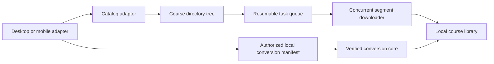

# Architecture

`evmedia` is a Rust core intended for Windows, macOS, Linux, Android, and iOS builds. It keeps the platform-specific work at the edge.

The portable Rust core accepts two documented JSON contracts:

- `Catalog`: course folders and video leaves, used for browsing and selection.
- `DownloadManifest v1`: authorized segment URLs, headers, ordering, and optional SHA-256 values. Downloads are written atomically and may run concurrently.

EVPlayer2 5.0.5 has a separate Windows live-manifest collector because that player holds video-specific information in its active process. Android, macOS, and iOS need their own adapters or companion apps. Stock iOS does not allow one app to inspect another app's memory or private files, so its adapter must receive data through an authorized in-app/export integration.
